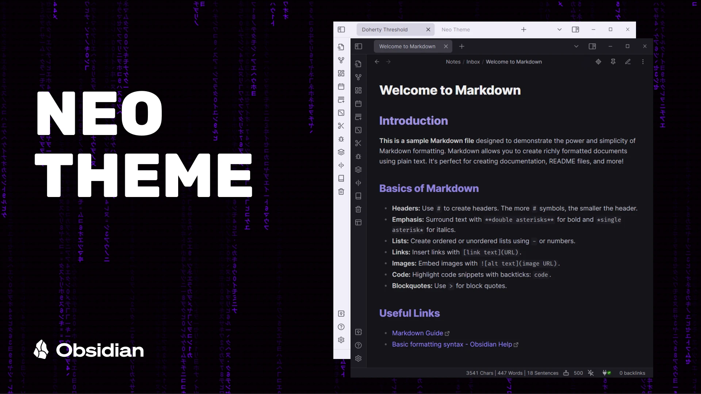
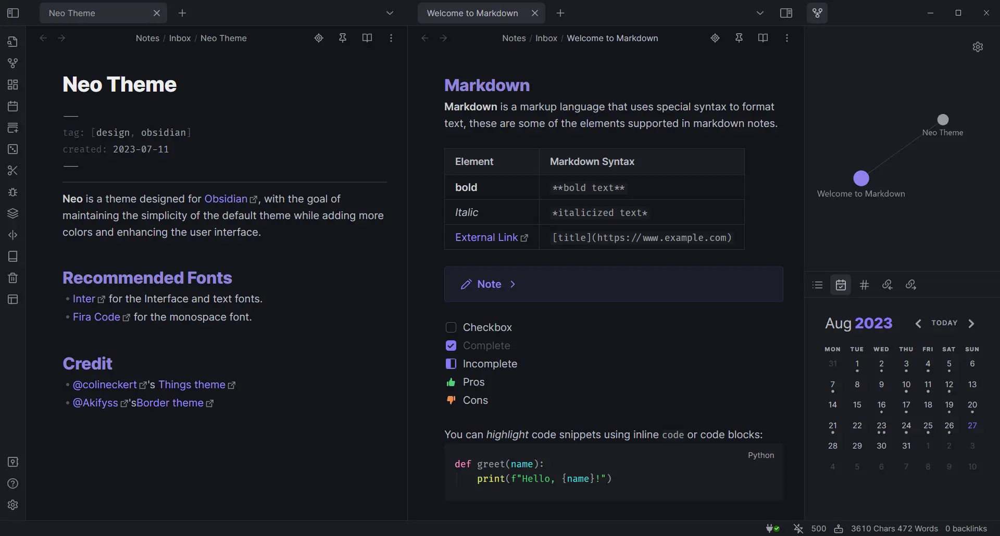
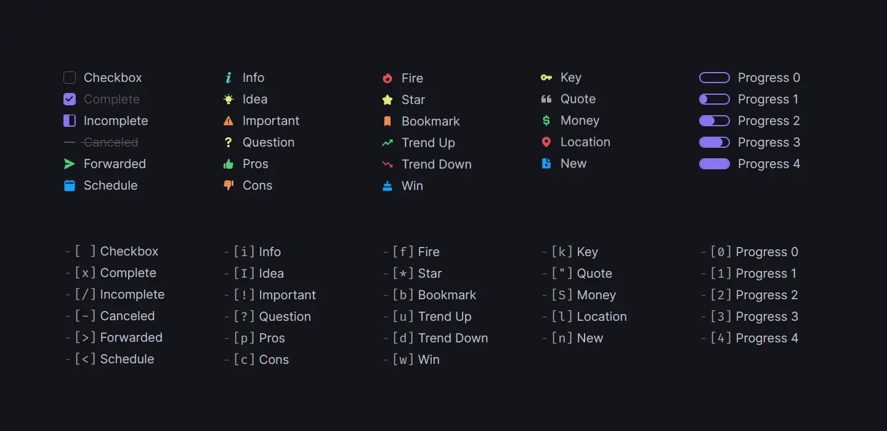
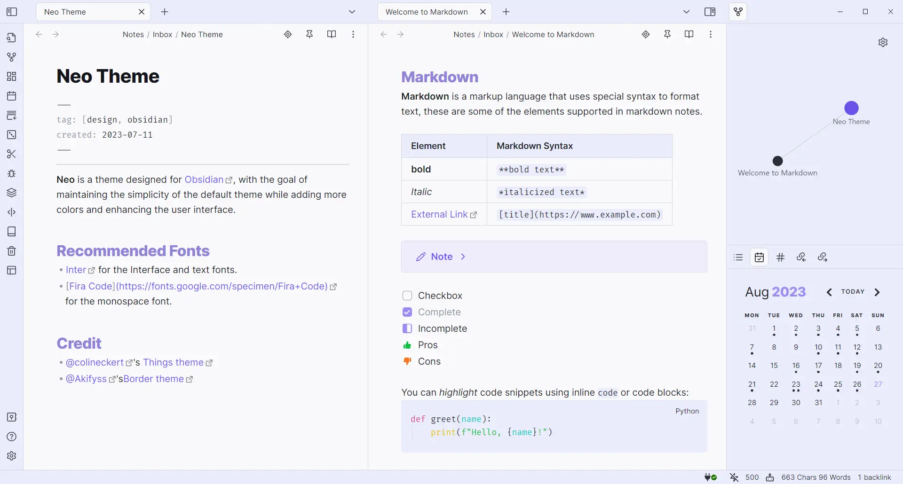

# **Neo Theme**

**Neo** is a theme designed for [Obsidian](https://obsidian.md/), with the goal of maintaining the simplicity of the default theme while adding more colors and enhancing the user interface.

## Features

- Dark and light theme support
- Mobile support
- Alternate Tabs
- Headings indicator
- Pointer cursor for clickable elements
- Alternate checkboxes
- Accent color affect background colors \*
- Active line indicator \*

\* _Turned off by default, need [style settings](https://github.com/mgmeyers/obsidian-style-settings) plugin to turn on_

## Screenshots

  
Light Theme

  

## Supported plugins

- [Dataview](https://github.com/blacksmithgu/obsidian-dataview)
- [Kanban](https://github.com/mgmeyers/obsidian-kanban)
- [Calendar](https://github.com/liamcain/obsidian-calendar-plugin)
- [Hover editor](https://github.com/nothingislost/obsidian-hover-editor)

## Recommended Fonts

- [Inter](https://fonts.google.com/specimen/Inter) for interface and text fonts.
- [Fira Code](https://fonts.google.com/specimen/Fira+Code) for monospace font.

## Credit

- [@colineckert](https://github.com/colineckert)'s [Things theme](https://github.com/colineckert/obsidian-things)
- [@Akifyss](https://github.com/Akifyss)'s [Border theme](https://github.com/Akifyss/obsidian-border)
