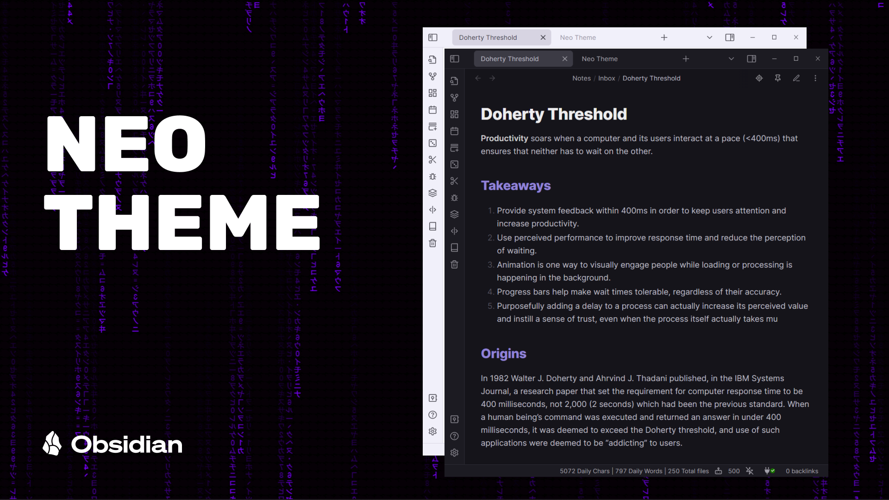
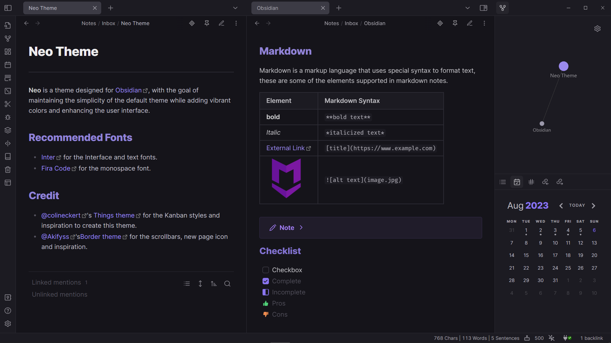

# **Neo Theme**

**Neo** is a theme designed for [Obsidian](https://obsidian.md/), with the goal of maintaining the simplicity of the default theme while adding vibrant colors and enhancing the user interface.

Please note that this theme was initially made for personal use, so it was not designed to be customizable. However, I do have plans to make customization possible in the future.

## Screenshot

## Recommended Fonts

- [Inter](https://fonts.google.com/specimen/Inter) for interface and text fonts.
- [Fira Code](https://fonts.google.com/specimen/Fira+Code) for monospace font.

## Credit

- [@colineckert](https://github.com/colineckert)'s [Things theme](https://github.com/colineckert/obsidian-things) for the Kanban styles and inspiration.
- [@Akifyss](https://github.com/Akifyss)'s [Border theme](https://github.com/Akifyss/obsidian-border) for the scrollbars, new page icon and inspiration.
