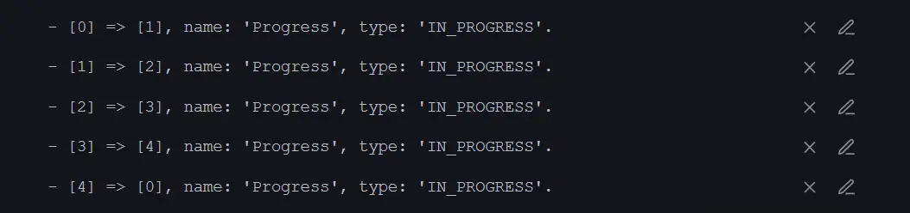

# **Neo Theme**

**Neo** is a theme designed for [Obsidian](https://obsidian.md/), with the goal of maintaining the simplicity of the default theme while adding more colors and enhancing the user interface.


## Features

- Dark and light theme support
- Mobile support
- Alternate Tabs
- Headings indicator
- Pointer cursor for clickable elements
- Alternate checkboxes

## Screenshots


<details>
  <summary>Light Theme</summary>
  


</details>

## Supported plugins

- [Dataview](https://github.com/blacksmithgu/obsidian-dataview)
- [Tasks](https://github.com/obsidian-tasks-group/obsidian-tasks)
- [Kanban](https://github.com/mgmeyers/obsidian-kanban)
- [Style settings](https://github.com/mgmeyers/obsidian-style-settings)
- [Calendar](https://github.com/liamcain/obsidian-calendar-plugin)
- [Hover editor](https://github.com/nothingislost/obsidian-hover-editor)

## Alternate checkboxes

Neo offers a variety of alternate checkbox types to help you highlight different task statuses.


```markdown
- [ ] Checkbox
- [x] Complete
- [/] Incomplete
- [-] Canceled
- [>] Forwarded
- [<] Schedule

- [i] Info
- [I] Idea
- [!] Important
- [?] Question
- [p] Pros
- [c] Cons

- [f] Fire
- [*] Star
- [b] Bookmark
- [u] Trend Up
- [d] Trend Down
- [w] Win

- [k] Key
- ["] Quote
- [S] Money
- [l] Location
- [n] New

- [0] Progress 0
- [1] Progress 1
- [2] Progress 2
- [3] Progress 3
- [4] Progress 4
```

<details>
  <summary>Task plugin statuses for progress checkboxes</summary>
  


</details>

## Helper Classes

CSS helper classes can be added to individual files using the `cssclasses` [frontmatter](https://help.obsidian.md/Editing+and+formatting/Properties) key. These classes can be combined to create different effects.

To enable a cards layout, add the following code at the top of your file:

```yaml
---
cssclasses: cards
---
```

### Cards (by [kepano](https://github.com/kepano))

Using `cards` transforms Dataview tables into cards that can be sorted using the [Sortable plugin](https://github.com/alexandru-dinu/obsidian-sortable). Similarly, you can also transform lists into cards using `list-cards`. Note that `cards` or `list-cards` must be present for the other classes to work.

| Class                   | Description                                      |
| :---------------------- | :----------------------------------------------- |
| `cards` (required)      | Activate card layout fot Dataview tables         |
| `list-cards` (required) | Activate card layout for lists                   |
| `cards-align-bottom`    | Align the last element of a card to the bottom   |
| `cards-cover`           | Images are resized to fill the defined space     |
| `cards-16-9`            | Fit images in cards to 16:9 ratio                |
| `cards-1-1`             | Fit images in cards to 1:1 ratio (square)        |
| `cards-2-1`             | Fit images in cards to 2:1 ratio                 |
| `cards-2-3`             | Fit images in cards to 2:3 ratio                 |
| `cards-cols-1` to `8`   | Force a specific number of columns (from 1 to 8) |

## Recommended Fonts

- [Inter](https://fonts.google.com/specimen/Inter) for interface and text fonts.
- [Fira Code](https://fonts.google.com/specimen/Fira+Code) for monospace font.

## Disclaimer

Please note that this theme is designed for my personal use of Obsidian. Therefore, it is not tested for all use cases.

## Credit

- [@kepano](https://github.com/colineckert)'s [Minimal theme](https://github.com/kepano/obsidian-minimal)
- [@colineckert](https://github.com/colineckert)'s [Things theme](https://github.com/colineckert/obsidian-things)
- [@Akifyss](https://github.com/Akifyss)'s [Border theme](https://github.com/Akifyss/obsidian-border)
